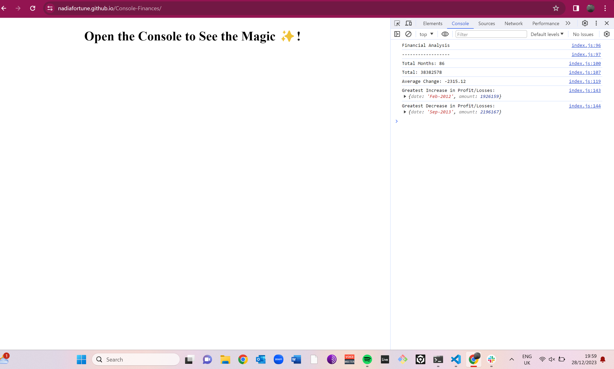

# Console-Finances

## **Description**

I created a short application that could be deployed in the console to allow a company to view its financial position over a set period of time.

The desired outcome was to allow for the following to be viewed:

-> The period being viewed
-> The total operating profit over the period
-> The average change in profit during the period
-> The greatest increase in profit and and decrease in losses during the period

Javascript was used to to produce the information required, with a mixture of simple and concatenated
syntax utilised.

The deployed page can be found here: https://nadiafortune.github.io/Console-Finances/

A screenshot of the deployed page is below:

## **Installation**

Right click in page and select 'inspect'. 
Select the Console tab and the result will be displayed as the screenshot above.

## **Usage**

N/A

## **Credits**

The following resources were used to research the coding funcionality for the successful deployment in the console: YouTube, w3schools, and MDN.

I did not use a tutor guidance session for this challenge.

## **Licence**

Please refer to the LICENCE in the repo.

